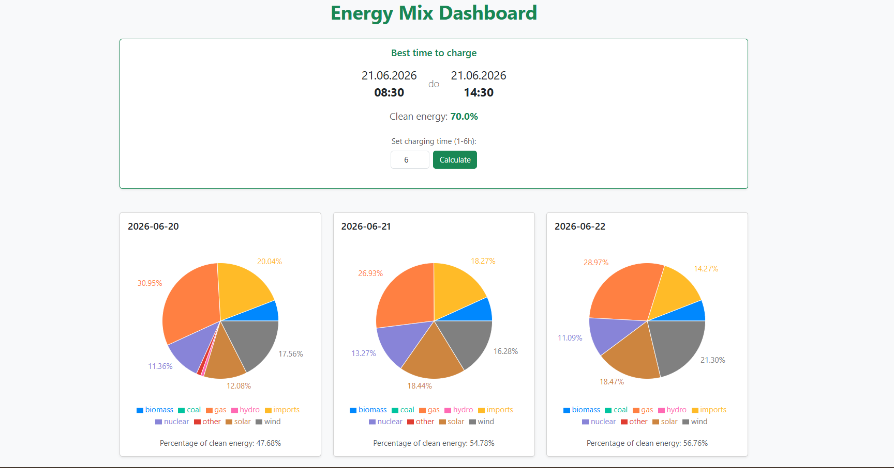

# Energy Mix Dashboard (Frontend)



A simple web application that visualizes the United Kingdom's energy mix and helps users find the most eco-friendly time window to charge electric vehicles.

## Live Demo
**[View Live Application](https://energy-mix-frontend-icpr.onrender.com/)**

## Features
- **Real-Time Energy Mix**: Displays a Pie Chart representing the energy generation mix in the UK.
- **Smart Charging Calculator**: Users can select a time period up from 1 hour to 6 hours, the app will show the best time window to charge the EV, that is, the time window with the lowest carbon intensity.
- **UI**: Built with a simple and clean UI with Bootstrap.

## Technology Stack
- **Framework**: [Next.js](https://nextjs.org/) (React)
- **Styling**: [Bootstrap](https://getbootstrap.com/)
- **Data Visualization**: [Recharts](https://recharts.org/)
- **HTTP Client**: [Axios](https://axios-http.com/)
- **Testing**: Jest & React Testing Library

## Local Setup

1. **Clone the repository** and navigate to the folder.
2. **Install dependencies**:
   ```bash
   npm install
   ```
3. **Configure Environment Variables**:
   Create a `.env.local` file in the root directory and specify your backend API URL (if running locally, point it to the Spring Boot server):
   ```env
   NEXT_PUBLIC_API_URL=http://localhost:8081
   ```
4. **Run the development server**:
   ```bash
   npm run dev
   ```
5. Open [http://localhost:3000](http://localhost:3000) in your browser.

## Cloud Deployment
This application is deployed on Render.com as a **Web Service**. 
